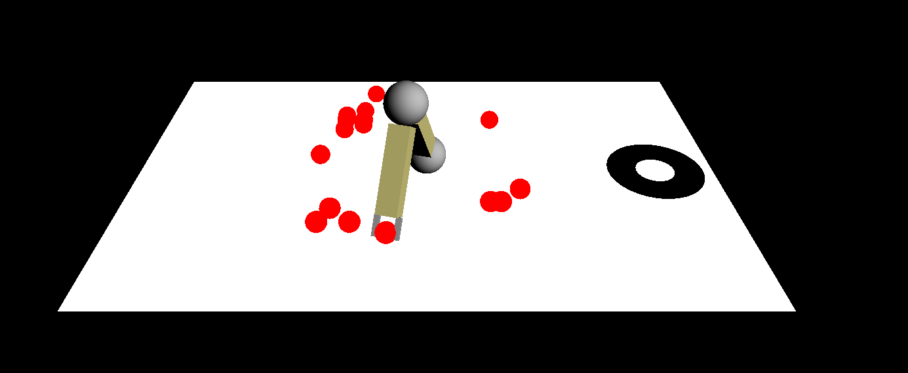

# RobotsArm-threejs
Pick up a fallen ball and carry it to the hole.



## Install
Clone this repo
```
https://github.com/naoki7090624/RobotsArm-threejs.git
cd RobotsArm-threejs
```
This code requires ThreeJS. Please install by
```
git clone https://github.com/mrdoob/three.js.git
mv three.js threejs-dev
```


